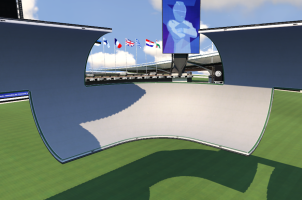
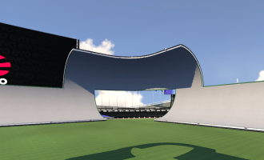
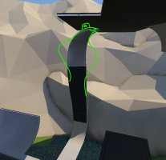
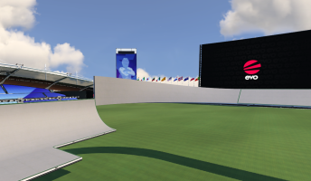
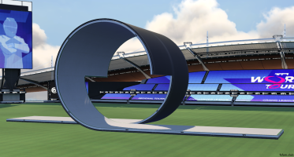
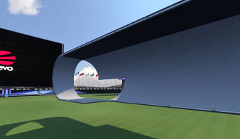
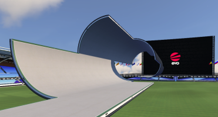

Here you can find short descriptions of terms, names and other things that pop up in fullspeed.

##### aAace
This often pops up in a team competition when every member of one team finishes before any of the opponent team's players. It comes from the old Fullspeed team *against All authority* (aAa).

##### Air-Brake (AB)
Airbrake refers to the technique where you break while in the air. This stops the forward rotation of your car and is used to make sure you get a flat landing. It is also commonly used to lower your air time.

##### Air Time
Air time refers to the state in which your wheels are not touching something that allows you to accelerate. This can be jumps, drops, or even vertical positions.

##### Anti-Boost
An antiboost is a booster that points in the opposite direction of the track, intended to slow you down. They are usually frowned upon as they ruin the momentum in a Fullspeed track.

##### Bottom Cake
A bottom cake is a reversed cake, so that you drive it at the bottom instead. The name comes from the fact that if you enclose 4 cake pieces together, it looks like a cake.

##### Cake
A cake is a feature that looks like a rounded wallride.

#### Cam 1/2/3
Cam 1 is the overivew camera. Cam 2 is a camera behind the car and follows the angle of your car. Cam 3 is the cockpit camera inside the car.

##### Cobra
A cobra is the name of a twisty loop/turnover feature. It is charcterized by the twist being at the top, but it is possible to drive it from the bottom or from the top. The cobra comes from a picture posted in the fsfam discord: 

##### Flow Trick
A flow trick is a technique where you drive over the curb on the side of the road, right before a jump. This gives you a nose-dive effect. The trick does not exist in TM2020 as the randstein curbs no longer exists. Used to reduce air time.

##### FMS
FMS refers to the Fullspeed Major Series. This is a series of 3 team competitions in fullspeed, and ends with the FMS grand finals. The three competitions, in order throughout the season are: FullSpeed League (FSL), Speed PremierShip (SPS) and FullSpeed Masters (FSM). Teams gather points based on their position in the three competitions, and the top 4 teams with the most points, are eligible to play the FMS playoffs which goes to the FMS grand finals.

##### FS
FS is simply the abbreviation of FullSpeed.

##### FSF/FSFam/Fullspeed Family
The Fullspeed Family is the most active community in Fullspeed. It is a fullspeed community for and by the players. It exists as a website, discord server and a club in-game where players that enjoy Fullspeed can discuss, share and play Fullspeed together.

##### Galaxy Drift (GD)
A galaxy drift is a technique for speed drifting down an upside-down quarterpipe. In some cases, you can also SD upwards in a quarterpipe (eg. in a turnover). It is usually done by first losing grip and then steer hard to initiate an SD down the quarterpipe. It only works at 800+ in tubes, pancakes, turnovers and other features that allow such conditions. The technique was named after Mariogalaxy who discovered it.

##### Hunter Wall
A hunter wall is a wall to banked transition, also refered to as a feature. It is commonly used in many advanced tracks to create more interesting features. Hunter walls are named after the player and mapper "Hunter", who popularized these transitions.

##### Jeffrey
The jeffery is a track feature where you exit a reverse turnover into a hunter wall, and down into a tube. It is typically recognized to be full magnet. It started off as a meme but people started using the name actively.

##### Loop
A loop is a feature with a circular shape that wraps around on itself, or in Trackmania, the entry and exits are close to eachother.

##### Loop Camera
The loop camera refers to the cockpit camera. It is commonly used by mappers in features when you drive up in a vertical position.

##### Memebounce
Memebounce is a trick where you force your car to land with your back wheels on a bump in the road. This gives a nose-dive rotation in a way that you keep your wheels on the ground the entire time. It is used to lower air time.

##### Midroad Bug
A midroad bug refers to a bug in which it looks like your car clipped something in the middle of the road, resulting in your car getting a "bump" of some sort and can even push you completely out of the track.

##### Nose-dive
A nosedive is a state in which the front of your car starts pointing downwards. In some cases it can be forced in order to get lower air time.

##### Reverse Turnover
A reverse turnover explains itself really, you enter a normal turnover in reverse. This is typically done by having magnets at the top to avoid losing grip.

##### Ride Trick
The ride trick is a technique where you do a left-right or right-left steering motion right before a jump in order to tilt your car, and sometimes also get a slight nose-dive. Used to reduce air time.

##### Pancake
A pancake is a feature that may remind you of a cake, but has a flat top part instead of it being rounded. It also looks like an angled turnover. The pancake requires free-blocking other half and can be rotated by different amounts. A magnet at the top is used to strengthen the grip of the car to make the feature smoother.

##### SD (Speed Drift)
Stands for Speed Drift and is a technique to accelerate faster than you normally could. It is recognized by overlapping the front and back skid marks from the wheels during a drift. Works at 420+ speed on tarmac, and 220+ speed on the other surfaces.

##### Speed Limit
Speed limit usually refers to the state where your car is limited to 800 speed due to acceleration decreasing drastically at 800+. This can happen due to grass patches or being close to 800 as you enter a feature.

##### S4D
A technique to start a speed drift by tapping the break very quickly. It was invented by a member of the team R4B and named it after that team.

##### Tube
A tube is a cyllindrical feature that you drive on the inside.

##### Turnover
A turnover is a feature that starts like a tube, but when you reach the top, it "turns around" and back. It is a way to do an instant 180 turn.

##### Tubewall
A tube wall is an wallride as the entry to a tube. Some people also refer to these features as corkscrews.

##### Transition
A transition refers to the connection between two sections. You're essentially *transitioning* from one part to another. Most people refer to transitions as some type of jump, but it doesn't have to be a jump as per defintion.

##### Wallride
A wallride is a vertical and rounded wall that you can drive on. Typically used to do sharp 90 or 180 degree turns.

##### 1-wheel SD
A 1-wheel SD is an SD, but you do it while only having 1 wheel touching the ground.

##### 2-wheel SD
A 2-wheel sd is an sd, but you're doing it with only 2 of the wheels touching the ground. This is usually done by having your car tilt on the side.
