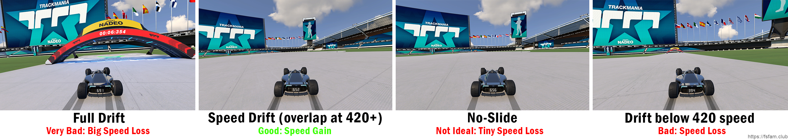

The previous page talks about how important speed is in Fullspeed. So how do we actually gain and maintain speed? Well, as you can imagine, your car can only accelerate if your wheels are on
the ground, have grip and you hold the forward acceleration button. So if your wheels lifts off from the ground and are in the air, or lose grip on the surface, you can't really accelerate anymore.

The concept of grip management is quite simple; on the surface you are driving on, you either have grip or not. However, it becomes a complex skill when we have multiple types of surfaces, the ground isnt flat anymore and we start driving in loops, tubes, wallrides or other vertical features.

We will talk more about grip management in the later chapters when we get to the different Fullspeed features. But for now, let's give you an introduction to the most basic type of grip management: avoiding drifts.

## The speed loss of drifting
When you are drifting/sliding below 420 speed or not doing a speed drift (an advanced technique we will talk about later, so ignore this for now), you will not accelerate as fast anymore. In fact, most of the time, there will be a negative acceleration. This can give a huge impact on your speed and may lose you seconds in a Fullspeed track.

If you have below 420 in speed, you should avoid all kinds of drifting as it will most likely slow you down. But when you are above 420, the most important thing to consider is to avoid *full drifting*.

As an example, this video illustrates how bad drifting can be in Fullspeed:


You can see how much more speed the car that isn't drifting compared to the car that is drifting. This gives a huge lead by the end. In real fullspeed tracks that are much longer than the one in the example video, this small drift can be the difference of seconds by the end of the track.

### Different drifting types
A full drift occurs when your drifting angle is so high that you see 4 skid marks behind your car. When the skids of your front and back wheels overlap while driving more than 420 km/h, this is called a *speed drift*. When your back and front wheels overlap completely, it is called a *noslide*. Only the second option will not lose speed.

To help illustrate what I mean by these different types of drifting, check out this image:

## Smooth Driving
When you drive Fullspeed, the best way to avoid drifting too much is to smoothen your steering inputs. On keyboard, this means small taps, while on controller you use the advantage of having an analog input.

Another reason to turn smoothly is that you actually lose a tiny bit of speed every time you turn, so if you minimize the amount of turning required, you will in generally be faster. The more you turn, the slower the forward acceleration will be. This can actually give an effect in longer tracks.

Drive the track smoothly, as much forward as possible, avoid sudden and hard steering inputs. This may be very difficult for a beginner, but the best way to get better at smooth driving is to get used to planning a head of time. Think about what is coming next, how different approaches will affect your line. Some modern Fullspeed tracks are so well calculated that they almost guide you through the turns and features so that it makes it easier to minimize steering.

The more you practice this, the better you get and you will automatically become faster in general by just driving more smoothly. If you are on controller, a tip could be to turn your sensitivity down, making your steering more "heavy" which forces you to turn more smoothly.