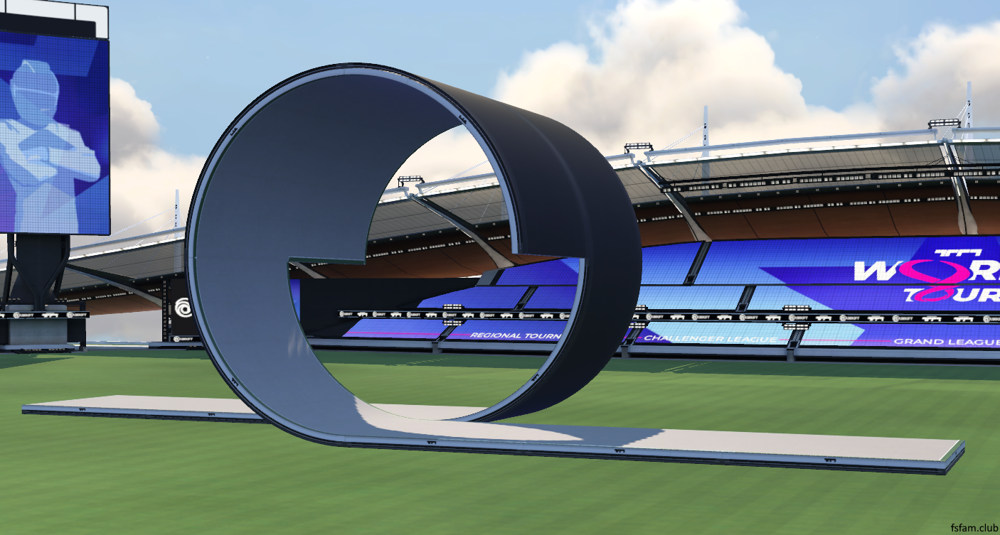
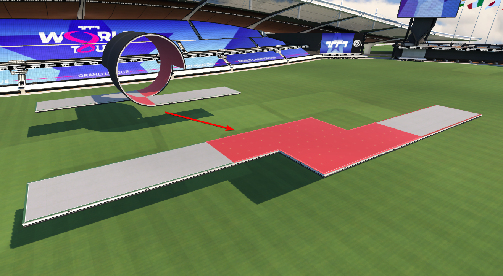
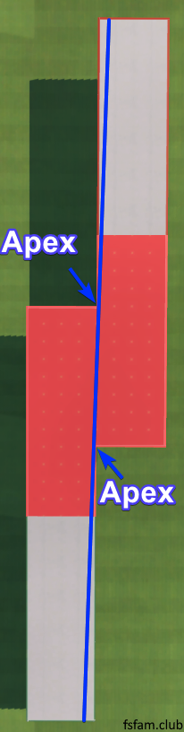
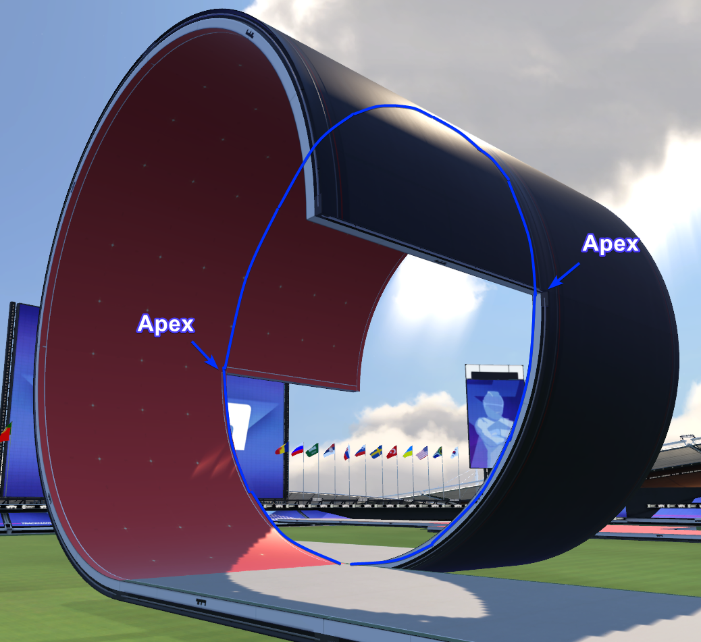

A loop is simply a shape that bends around and connects back onto itself. In Trackmania, this would in theory not work well if we were to follow this concept to the letter. So instead of connecting loops back onto itself, they end up close to where they started.

The loop is the most basic feature that you encounter in Fullspeed maps. To get through a loop, it is as simple as going straight into it, steer a bit towards the direction where the exit is, and just go straight down and out. Most players will understand how to get through a loop without any help.

However, driving loops optimally is not as easy as it sounds. So let's analyze the behavior of the basic loop and see what the best way is to drive it.

## The shortest path in a loop

Imagine we unwrap a loop, and lay it out completely flat as demonstrated in this image:

If we then take a look at the loop wrapped out completely flat, we see that the shortest path to drive is the complete middle:

We have two corners we can aim for in a loop. These are the loop's apexes. You can imagine that if you were to begin all the way from the bottom left and drive all the way up to the upper right, this is a much longer path to travel than if you were simply staying near the middle the entire way.

So how does this look like in the actual loop? Let's take a look:

An interesting thing to think about is that what you are essentially trying to do, is to drive a real loop. Connecting the start and end onto eachother, like we talked about earlier! It's like you're trying to draw a perfect circle inside the loop, and the only way to do this is in the middle of it.

## Speed in a loop
Driving the shortest path is not the entire picture. Your speed matters, especially in a Fullspeed track. If you drive the shortest path in a loop perfectly, you will also, in theory, lose the least amount of speed. But it is not always easy to do this in a real track, where there are lots of different angles going into the loop. So let's take a look at how the speed works inside the loop.

### The good loop line


Ideally, you want to drive the loop completely in the middle, with as little steering as possible. We try to aim for the two apexes in the loop.

This not only is the shortest path as we've seen before, but it also loses the *least* amount of speed. In the video above, we end up with 441 speed by the end.

### A bad loop line
Let's try to enter the loop far from the left side, and then exit far to the right side:



When we reach the end, it's almost 10 speed less! That is a huge amount of speed-loss compared to driving the good line. Not only that, the path we are driving is also longer. This demonstrates how much you can actually lose from a bad line in a loop.